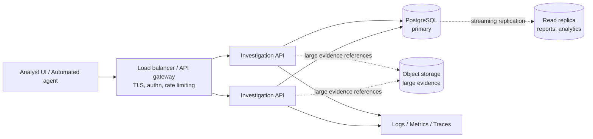

# Architecture and deployment

This document covers how the system is built, how it would be deployed, and
what would need to change as it grows. The domain rules themselves live in
[domain-model.md](domain-model.md); the package layout and its boundary rules
live in [package-structure.md](package-structure.md).

## 1. Runtime shape

The service is a single stateless Go binary talking to one PostgreSQL
database. There is no cache, no broker, no background worker, and no
coordination between instances — all shared state lives in PostgreSQL, and the
one operation that needs mutual exclusion gets it from a row lock.



Dotted edges are described here but not implemented in this repository.

## 2. Stateless horizontal scaling

Every API instance is interchangeable. A request carries all the context it
needs, instances share nothing in memory, and no instance owns any
investigation. Scaling out is adding replicas behind the load balancer; there
is no leader election, no sticky routing, and no rebalancing.

This holds precisely because workflow state is in the database rather than in
process memory. Two agents working the same investigation through two
different replicas are safe for the same reason two agents on one replica are:
correctness comes from `SELECT ... FOR UPDATE`, not from process locality.

## 3. Concurrency control

Advancing an investigation is the only operation where two callers can
genuinely conflict, and it is handled in one transaction inside
`internal/repository/postgres/investigation.go`:

```sql
BEGIN;
SELECT ... FROM investigations WHERE id = $1 FOR UPDATE;   -- serialize
-- load the selected edge and its destination, scoped to this playbook version
-- run the pure domain rule: does this edge leave the current node?
INSERT INTO investigation_steps (... sequence_number = MAX + 1 ...);
UPDATE investigations SET current_node_id = ..., status = ...;
COMMIT;
```

Two simultaneous submissions serialize on the row lock. The first applies. The
second then re-reads a current node that has already moved, finds its edge no
longer originates there, and is rejected with `409 INVALID_TRANSITION`. It
never silently overwrites the first, and the audit trail cannot fork.

**Why pessimistic locking rather than an optimistic version column.** Both are
correct here. A row lock was chosen because contention on a single
investigation is rare (one analyst, or one agent, works one investigation at a
time), the critical section is a few milliseconds of local queries, and the
failure mode is a clean rejection rather than a retry loop the client must
implement. An optimistic `version` column would push conflict handling onto
every client for a conflict that almost never happens. The trade-off would
invert if investigations became long-running or involved external calls inside
the transaction — neither is true, and neither should become true (see §7).

Publishing a playbook version takes the same kind of lock on the version row,
so a concurrent draft edit cannot substitute a different graph between
"validated" and "published".

## 4. Migrations

Migrations are golang-migrate SQL files in `migrations/`, embedded into the
binary (`migrations/embed.go`) and applied at startup when `RUN_MIGRATIONS` is
true — the default, which is what makes `docker compose up --build` a single
step with nothing hidden in a shell script. golang-migrate takes a PostgreSQL
advisory lock, so several replicas starting at once serialize safely.

**In production this should usually be a separate step.** `cmd/migrate` exists
for exactly that: run it as a deployment job (or init container) before rolling
out new application pods. The reason is rollout ordering — with startup
migrations, the first new pod migrates the schema while old pods are still
serving against it, so every migration must be backward compatible with the
running version for the length of the rollout. That discipline (expand, then
migrate, then contract in a later release) is worth keeping either way, but a
separate step makes a failed migration abort the deploy before any new code
serves traffic.

## 5. Observability

**Implemented here:** structured JSON logs via `slog`, with a request ID
generated (or adopted from `X-Request-Id`) per request and automatically
attached to every log line emitted while handling it. Domain events —
playbook published, investigation started, decision applied, investigation
completed — are logged with the identifiers an operator would search on:
`request_id`, `alert_id`, `investigation_id`, `playbook_version_id`,
`sequence_number`, `actor_type`, `actor_id`.

Rationale, evidence and alert payloads are deliberately **not** logged. They
are the audit record's content, they can contain customer site detail, and they
are already durably stored where an auditor reads them. Logs answer "what
happened and to which investigation", not "what did the analyst conclude".

`/healthz` reports process liveness and checks nothing external — if liveness
depended on the database, one database blip would make an orchestrator restart
every healthy replica. `/readyz` checks database connectivity, so an instance
that cannot serve is removed from rotation without being killed.

**What production would add:**

- **Metrics** (Prometheus): request rate/latency/error rate by route and status;
  `investigations_started_total`, `investigations_completed_total` by
  resolution, `decisions_rejected_total` by error code; `pgxpool` statistics
  (acquired, idle, wait duration) — pool exhaustion is the failure this
  service would hit first under load.
- **Tracing** (OpenTelemetry): spans per request and per database round trip.
  The decision transaction is the span worth watching: it holds a row lock, so
  its duration is the system's concurrency budget.
- **Alerting**: 5xx rate and p99 latency by route; readiness failures; database
  connection saturation and replication lag; and a domain-level alert on
  investigations stuck `in_progress` well beyond their playbook's typical
  duration — an agent that crashed mid-investigation leaves no error anywhere
  else, only an investigation that stops advancing.
- **Database monitoring**: slow query log, `pg_stat_statements`, lock waits,
  table/index bloat, and backup/PITR success.

None of this is implemented locally: standing up a metrics and tracing stack in
docker-compose would add far more moving parts than it demonstrates.

## 6. Data durability and evidence

PostgreSQL is the single source of truth. Production would run a managed
instance (or a primary with a synchronous standby), with automated backups plus
point-in-time recovery — an investigation report is a record of a security
decision, and losing one is losing evidence.

Read replicas would be worth adding when reporting or analytics traffic grows:
`GET /report` and any future cross-investigation querying are read-only and
tolerate replication lag. Decision submission must stay on the primary — it
takes a row lock and writes.

**Large evidence** (pcaps, screenshots, historian exports) does not belong in
`evidence` JSONB. The intended shape keeps the engine unaware of storage
providers: the evidence item carries a reference, the bytes live in
S3-compatible object storage, and the API returns a pre-signed URL on read.

```json
{
  "type": "pcap_capture",
  "summary": "3.2 MB capture around the write, 10:29:50-10:30:10",
  "data": { "object_key": "s3://indurex-evidence/2026/08/19/abc123.pcap", "bytes": 3355443 }
}
```

Retention differs by data class: investigations and steps are compliance
records and are kept for years; large artifacts are expensive and would get a
shorter lifecycle policy, with the reference remaining in the audit trail after
the object expires so the report still shows what was collected.

## 7. Why no queue, worker, or event-sourcing infrastructure

Every operation here is a short, synchronous, user-or-agent-initiated state
transition on one row. Submitting a decision is a handful of local queries
inside one transaction; there is no long-running work, no fan-out, and nothing
to retry in the background. A broker would add an operational component, a
delivery-semantics problem, and an eventual-consistency window, in exchange for
nothing this workload needs.

The audit trail is already append-only and event-shaped
(`investigation_steps`), so the property event sourcing is usually reached for
is present without the machinery. `investigations.current_node_id` is a
denormalized projection of those steps, maintained in the same transaction that
appends them — never reconstructed, never allowed to disagree.

**When that changes.** Asynchronous processing earns its place once work stops
being request-shaped:

- **Autonomous agents** that gather evidence by calling out to historians,
  asset inventories or an LLM. Those calls are slow and failure-prone, so they
  must not run inside the decision transaction. The natural design keeps this
  API unchanged and puts the agent *outside* it: a worker consumes alerts,
  gathers evidence, and calls `POST /decisions` exactly as a human UI does.
  That is why the API is agent-shaped rather than LLM-coupled — the agent
  becomes a client, not a new subsystem inside the engine.
- **High-volume alert ingestion**, where an upstream system pushes faster than
  investigations can be started. `POST /alerts` is already idempotent on
  `external_id`, so putting a queue in front of it is a deployment change, not
  a redesign.

## 8. Deployment and rollout

Rolling deployments work without special handling: instances are stateless and
interchangeable, in-flight requests drain on `SIGTERM` (graceful shutdown with
a bounded timeout), and no request outlives its own transaction.

Two ordering rules matter. Migrations run before new code (§4), and they must
be backward compatible for the duration of a rollout, because old and new
instances serve the same schema simultaneously. Additive changes ship freely;
destructive ones (dropping a column, tightening a constraint) ship as a later
release once nothing references the old shape.

Configuration is entirely environment variables (`internal/config`), with
`DATABASE_URL` the one value that must come from a secret store rather than a
compose file.

## 9. Security posture

Authentication and authorization are out of scope for this exercise and would
sit at the gateway plus a middleware in `internal/http`; the roles and their
permissions are described in the README's "Production considerations".

What the implementation does do, because these are cheap and structural:
request body size limits, explicit server timeouts on every phase, strict JSON
decoding that rejects unknown fields, UUID path parameters validated before
they reach the database, parameterized queries throughout, panic recovery, and
error responses that never carry driver or SQL text. The API also refuses to
trust clients on workflow: a client selects an edge, and the server — never the
client — determines the resulting node.

The one gap worth naming explicitly: `actor` is self-reported. Today it records
a claim, not a verified identity. With authentication in place, the actor would
be derived from the authenticated principal and the request field ignored, at
which point the audit trail becomes attributable rather than merely descriptive.
